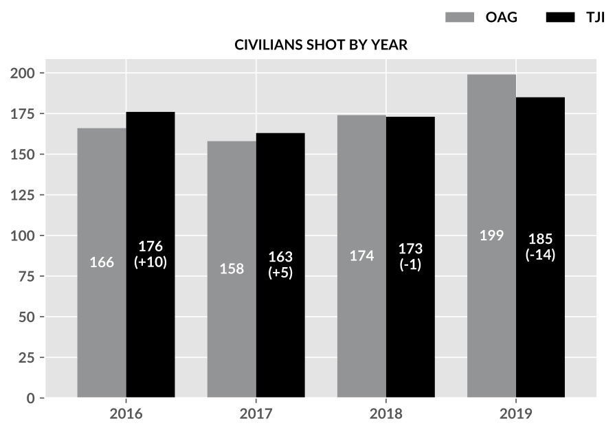

# OFFICER-INVOLVED SHOOTINGS IN TEXAS: 2016-2019

*The Texas Justice Initiative (TJI) is a nonprofit organization that collects, analyzes, publishes and provides oversight for criminal justice data throughout Texas. This “Officer-Involved Shootings in Texas" report analyzes data from reports filed for shootings over a four-year period. The goal of this report is to identify patterns and make comparisons of officer and civilian injuries and deaths during officer-involved (OIS) shooting incidents across a variety of variables.*

# I. Executive Summary
Texas law requires the Office of the Attorney General (OAG) to collect reports on all officer-involved shootings throughout Texas and then provide the summary of the individual reports in “The Peace Officer Involved Shooting Annual Reports.” The OAG digitally publishes these annual reports, which are extremely high-level summaries, with no findings or analysis of trends or intersectionality. Texas Justice Initiative (TJI) reviewed the officer-involved shooting incidents data from law enforcement agencies in Texas between 2016 and 2019. This TJI publication improves upon the OAG’s annual reports by providing in-depth analyses with more granular information. **This report consists of two parts**:
- The **Data Summary** section provides an overview of the incidents as intersectional information such as the total number of civilian severities per county and per race demographics.
- The **Data Insight** section provides TJI’s independent analysis of the officer-involved shootings, including notable patterns in the data.

-----
# II. Data Summary

The OAG annual reports, and this TJI four-year analysis report, summarize officer-involved shooting reports submitted to the OAG by local law enforcement agencies. The reports reflect shootings of and by law enforcement officers that took place in Texas from 2016 to 2019.

Every record in the officer-involved shooting data represents either a civilian or an officer who was shot. This means every person in the dataset was shot and harmed. Currently the data represents the severity of the shooting as binary information: **injury** or **death**. For the majority of the analyses, we focus on two populations: **officers** and **civilians**. We use the following terminology through the report:

|Terms              |Corresponding sub population in the data  |
|-------------------|------------------------------------------|
|**Civilians Shot** |Civilians who are either injured or killed|
|**Civilian Deaths**|Civilians who are killed                  |
|**Officers Shot**  |Officers who are either injured or killed |
|**Officer Deaths** |Officers who are killed                   |

The details of data acquisition and data preprocessing can be found on our [website](https://texasjusticeinitiative.org/) and our [public GitHub repository](https://github.com/texas-justice-initiative/).

## 1. Comparison between the OAG annual reports and TJI multi-year datasets
The total number of civilians shot by officers in Texas from 2016 to 2019 is identical in the OAG reports and TJI datasets (697 incidents). However, the totals from individual years are slightly different (Fig. 1).

  

  
  <em>Fig.1. Number of civilians shot in officer-involved shootings from 2016 to 2019 in the OAG reports and TJI datasets</em>

# IV. Conclusions
Texas Justice Initiative’s analyses of officer-involved shootings in Texas over four years (2016-2019) reveals several notable patterns. Among our main findings:

1. Shootings of civilians and their subsequent deaths caused by officers have been increasing over the four years (Figs. 1 and 15)
2. Officers were twice as likely to survive shootings than civilians who are shot by officers (Fig. 16)
3. As one might expect, the majority of officer-involved shootings in Texas occurred in the state's five most populous counties. DPS shooting reports also comprise a large portion of those filed every year (Fig. 14)
4. Black individuals were overrepresented in the five most populous counties compared to the general population (Fig. 18)
5. Among those shot and killed by Texas law enforcement, young Black men ages 15-24 were over-represented at a rate of almost three  times when compared to the general population (Fig. 20)
